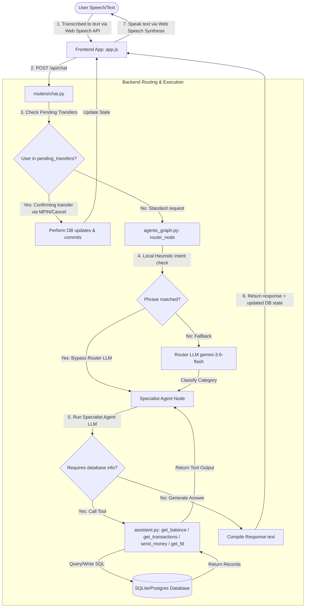
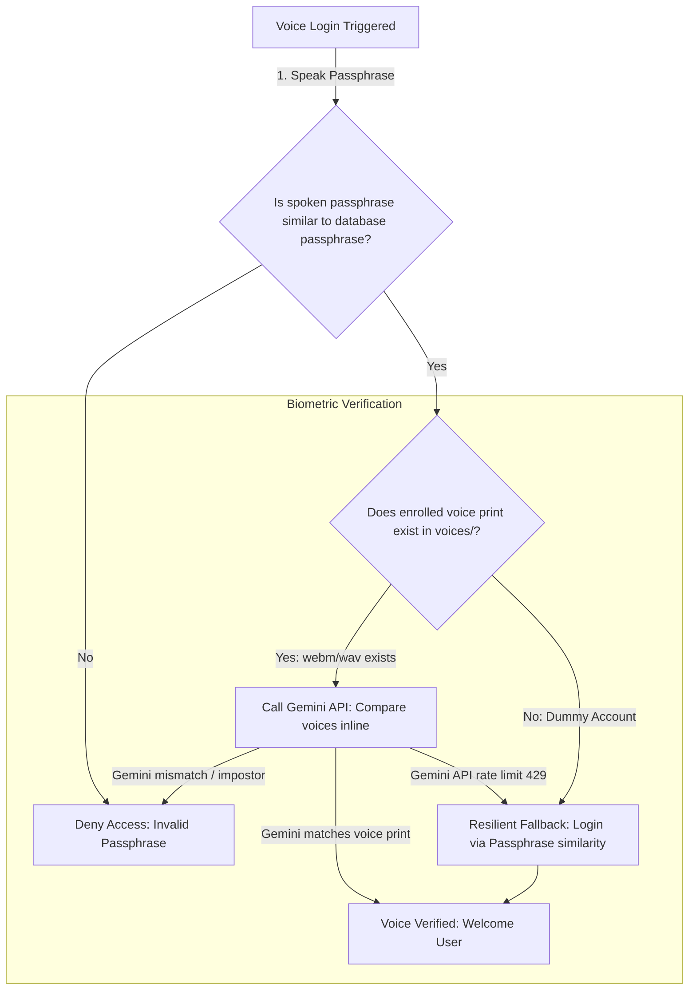

# NidhiVani Voice Banking Assistant - System Architecture

This document describes the folder structure, component responsibilities, and the end-to-end request and conversational flow of the NidhiVani Voice Banking Assistant project.

---

## 📂 Project Structure & Component Responsibilities

Here is the breakdown of the backend files and their respective tasks:

```text
d:/final project 1/
│
├── main.py                 # Application entry point. Mounts frontend static assets, sets up FastAPI, Lifespan context, and CORS.
├── database.py             # Database engine setup (SQLModel), schema migrations, and initial seed data generation.
├── models.py               # SQLModel database table definitions (UserTable, TransactionTable, FixedDepositTable).
├── schemas.py              # Pydantic schemas representing HTTP request bodies (login, registration, chat, transfers).
├── utils.py                # Text processing helpers (Devanagari transliteration, phonetic/similarity matching, token logging).
├── translations.py         # Multi-lingual localization dictionaries for English (en-IN), Hindi (hi-IN), and Marathi (mr-IN).
├── assistant.py            # Gemini API client instantiation, LLM tools (check balance, FD details, transactions, send money), and session states.
├── agents_graph.py         # LangGraph workflow structure (receptionist router node, account specialists, FD specialists, support specialists).
│
├── routers/                # FastAPI endpoint routers (modularized API controllers)
│   ├── __init__.py         # Aggregates all domain-specific routers into a main master router.
│   ├── auth.py             # User register, login, voice biometrics matching, password resets, and voice resetting.
│   ├── accounts.py         # Fetching user state (balances, FDs), user directories, and transaction histories.
│   ├── payments.py         # Direct manual money transfer endpoint (MPIN secured).
│   ├── chat.py             # Chatbot gateway (handles voice chat queries, voice-confirmations, pending transfers, and simulation fallback).
│   └── document.py         # Utility routes (PDF bank statement downloads).
│
├── static/                 # Frontend Web Application (HTML5, Vanilla CSS, JS)
│   ├── index.html          # Chat and banking dashboard layouts.
│   ├── style.css           # Styling system (responsive layouts, dark glassmorphic widgets, hover animations).
│   └── app.js              # Speech recognition/synthesis handlers, API call controllers, and state updates.
│
├── voices/                 # Directory holding enrolled WebM speaker voice prints (e.g. `alice_enroll.webm`).
├── token_usage.log         # JSON-line logs tracking token consumption stats for every LLM call.
└── requirements.txt        # Backend python dependencies.
```

---

## 🔄 System Architecture Flow

The following diagrams illustrate how user commands, speech inputs, and backend logic interact.

### 1. Conversational Chat & Command Flow

This diagram shows how a spoken voice message or text chat moves through the system, gets routed, uses database tools, and responds to the user:



---

## 🔐 Authentication & Voice Biometric Flow

This diagram shows what happens when a user attempts to log in using their voice passphrase:



---

## 📈 Monitoring & Logging

All LLM calls (both inside `agents_graph.py` nodes and dynamic recipient resolution in `assistant.py`) trigger the `log_token_usage` utility. 
This logs token consumption to the console and appends to `token_usage.log`:

```json
{"timestamp": "2026-08-09 02:08:32", "agent": "Account Specialist Agent", "input_tokens": 342, "output_tokens": 84, "total_tokens": 426}
```
